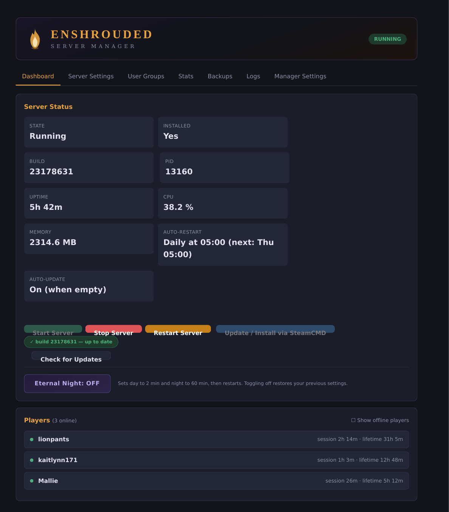
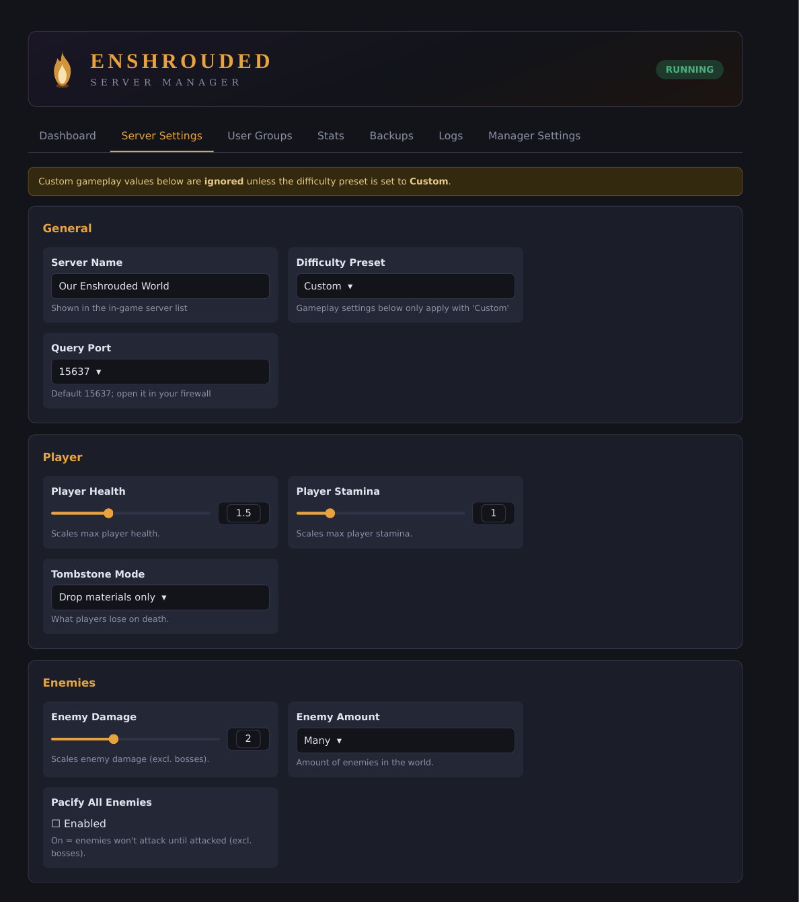
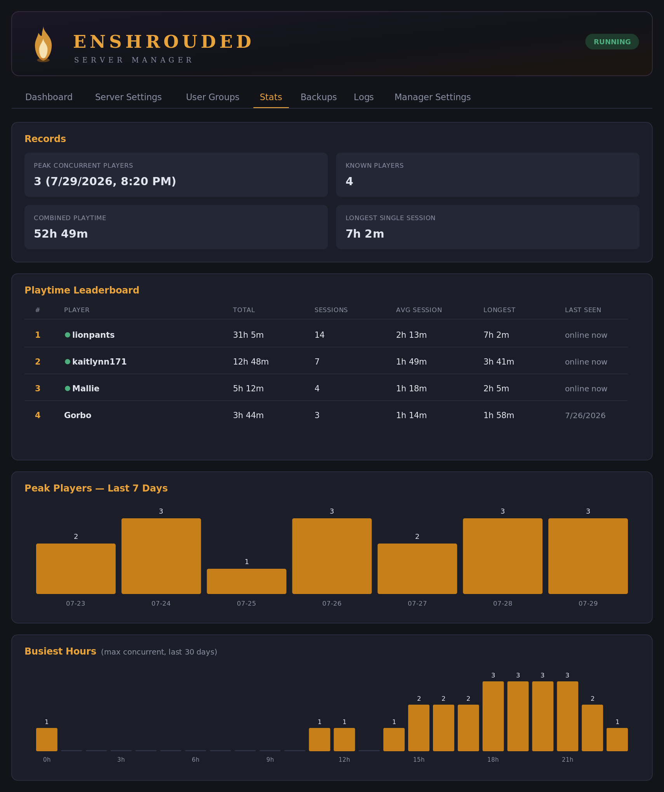

# Enshrouded Server Manager

A self-hosted web UI for managing an Enshrouded dedicated server on Windows. Runs on the server machine; no external services or accounts required.



## Setup (on the server machine)

1. Copy this folder to the machine that runs the Enshrouded server.
2. Install Python 3.10+ (check "Add to PATH" during install).
3. Install dependencies:
   ```
   pip install -r requirements.txt
   ```
4. Start the manager by double-clicking `start_manager.bat` (or `python main.py`).
5. Open http://127.0.0.1:8555 in a browser on that machine.
6. Go to **Manager Settings** and set:
   - Server install directory (folder containing `enshrouded_server.exe`)
   - Path to `steamcmd.exe` (download from Valve if you don't have it)

If the server isn't installed yet, clicking **Update / Install via SteamCMD** performs a fresh install into the server directory (Steam app `2278520`).

## Dashboard

- Live status: running/stopped/updating pill, PID, uptime, CPU, RAM, installed Steam build ID. Refreshes every 5 seconds.
- Start, stop, and restart the server (stop/restart ask for confirmation; graceful terminate with kill fallback). Restarting is also the only way to force a full resource/terrain respawn: Enshrouded has no admin commands, and while areas outside Flame Altar zones reset on their own every ~2 hours, terraformed terrain only fully resets on a server restart.
- Auto-restart status card: shows whether the daily scheduled restart is on, its time, and the next occurrence.
- **Players panel**: live list of connected players with per-player session time, queried from the game server's Steam A2S endpoint on the query port (server-authoritative durations, refreshed every ~20s). Enshrouded leaves names blank in A2S responses, so names come from the server log: the manager tracks `Player 'Name' logged in` and `Remove Player 'Name'` lines, and uses the ~5-minute autosave blocks (`Sending Character Savegame 'Name'`, which list every connected player) as an authoritative roster baseline — so names stay correct even after log rotation or joins that scrolled out of the parse window. Names are matched to sessions by join order (longest session = earliest joiner), and internal handles like `1(1)` are filtered out of every source. The patterns are configurable via `playerNamePatterns` / `playerLeavePatterns` in `manager_config.json` in case a game update changes the wording. If no name can be found, players show as "Player 1", "Player 2", etc. Clicking a player opens a modal with their current session length, lifetime playtime, completed session count, and first/last-seen dates. A "Show offline players" toggle also lists everyone previously seen (dimmed, with last-seen date and lifetime total); the preference is remembered per browser. Lifetime totals are accumulated by the manager into `playtime.json` (sessions are credited when a player disconnects; totals survive manager restarts, but time played while the manager is closed isn't counted).
- **Eternal Night toggle**: one click sets daytime to the game minimum (2 min) and nighttime to the maximum (60 min), switches the preset to Custom (required for the values to apply), and restarts the server if running. Your previous day/night lengths and preset are stashed and restored exactly when toggled off (with another restart). The button glows while active.
- **Update / Install via SteamCMD** with live console output streamed into the page. Blocked while the server runs, and starting the server is blocked while updating.
- **Update checking**: the latest public build is checked automatically every 10 minutes (steamcmd.net API, falling back to a local steamcmd query; results cached 10 minutes). A build pill above the buttons shows "✓ build N — up to date" when current; when a newer build is available it switches to a warning ("⚠ build N → M available"), the update button pulses, and a warning banner appears on every tab. All of it clears after updating. **Check for Updates** forces a fresh check.
- **Auto-update** (off by default, Manager Settings): when a new build is found, the manager backs up the world, stops the server, runs the SteamCMD update, and starts the server again — automatically. With "Only when empty" enabled (default) it waits until no players are online first; the dashboard shows "Update pending — waiting for empty server" while it waits. If the server was already stopped when the update was found, it updates but leaves the server stopped.

## Server Settings



Edits `enshrouded_server.json` — every field of the current (0.9.0.0) format:

- General: server name, bind IP, query port, player slots, save/log directories, voice chat (on/off, Proximity/Global), text chat, difficulty preset (Default / Relaxed / Hard / Survival / Custom).
- All 37 gameplay settings, grouped as Player / Survival / World / Resources & Progression / Enemies, each with the correct control (slider, dropdown, toggle) and the official min/max ranges. Time values (day/night length, hunger timer) are shown in minutes and stored as nanoseconds automatically.
- The game only applies custom gameplay values when the preset is **Custom** — the UI shows a reminder whenever another preset is selected.
- Values are validated server-side before writing; invalid configs are rejected with an explanation.
- Before every save the existing config is copied to `config_backups/` (last 20 kept).
- **Save Configuration** writes the file (warns that a restart is needed if the server is running); **Save & Restart Server** saves, then stops and starts the server in one step. The server reads its config only at startup, so a restart is required for changes to take effect.

## User Groups

Add, edit, and delete user groups: name, join password, reserved slots, and all six permissions (kick/ban, access inventories, edit world, edit base, place/upgrade Flame Altars). Players join with a group's password and receive its permissions — the UI warns that a group with an empty password lets anyone join.

## Stats



Built from the manager's own tracking (the game exposes no combat stats): records cards (peak concurrent players with timestamp, known players, combined playtime, longest single session), a playtime leaderboard (total, sessions, average and longest session, last seen, online indicator), and two charts — peak players per day over the last 7 days, and busiest hours of the day over the last 30 days. Hourly concurrency history is stored in `history.json` (30-day retention); longest-session tracking starts from when this feature was installed.

## Backups

The game server does **not** back up world saves itself (it only rotates log files), so the manager does:

- **Create Backup Now** — zips the savegame folder into `save_backups/`. Works while the server runs, with a warning that a stopped-server snapshot is the guaranteed-consistent option.
- **Auto-backup** — configurable interval (default 6 hours) and retention count (default 24, oldest deleted). Runs while the manager is open; paused during SteamCMD updates.
- **Restore** — requires the server to be stopped; a safety copy of the current world is made first, so a bad restore can't lose anything.
- **Download** and **Delete** per backup.

## Logs

Shows the tail of the newest server log file, with refresh.

## Manager Settings

Paths (server directory, executable name, steamcmd path), the manager's own bind host/port, and **daily auto-restart**: pick a time (24h, server machine's local time) and the manager restarts the game server once a day — useful for forcing resource respawns and keeping memory fresh. It only fires if the server is running (a stopped server stays stopped), skips while a SteamCMD update is in progress, and fires at most once per day. Note: players are disconnected without warning (the game has no in-game messaging), so pick a quiet hour. Like auto-backup, it runs inside the manager process, so the manager must be running. Path and schedule changes apply immediately; host/port changes need a manager restart.

## Accessing from another computer (optional)

The manager binds to `127.0.0.1` (that machine only). To reach it from your own PC over the LAN, set the bind host to `0.0.0.0` in Manager Settings and restart the manager — but be aware there is no login, so only do this on a trusted network, or keep it on 127.0.0.1 and use an SSH tunnel / RDP.

## Files

| File | Purpose |
|---|---|
| `main.py` | FastAPI backend (process control, SteamCMD, config, players, backups, stats) |
| `static/index.html` | Web UI (single file, no build step) |
| `manager_config.json` | Manager settings, created on first run |
| `playtime.json` | Per-player lifetime playtime records, created at runtime |
| `history.json` | Hourly player-count history for the Stats charts, created at runtime |
| `start_manager.bat` | Convenience launcher |
| `requirements.txt` | Python dependencies (fastapi, uvicorn, psutil, python-a2s) |

Created in the server directory at runtime: `config_backups/` (config file backups) and `save_backups/` (world backups).
